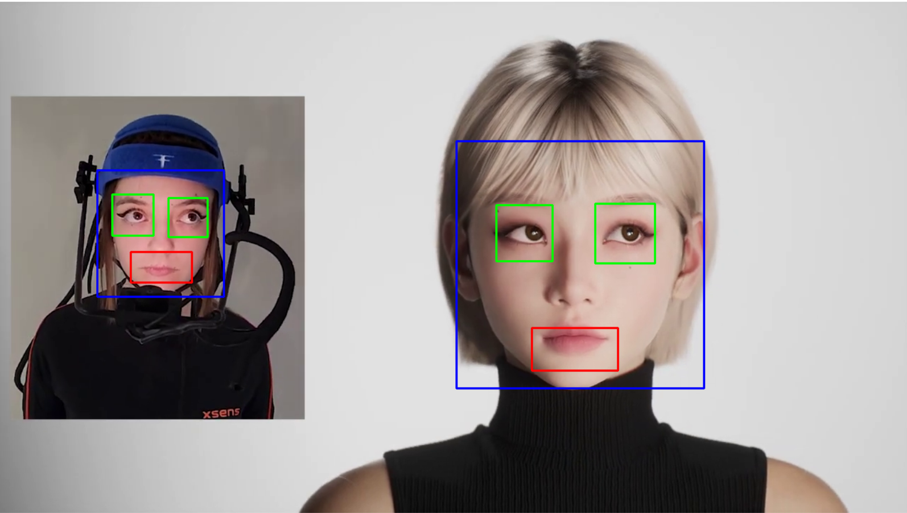

# Распознавание лица, глаз и улыбки 

##  Задание

Реализовать детекцию лица, глаз и улыбки на видеопотоке с помощью алгоритма каскадов Хаара. 

## Результат

Программа обрабатывает видеофайл и находит на каждом кадре:
- лицо (выделяется **синим прямоугольником**),
- глаза (выделяются **зелёным прямоугольником**),
- улыбку (выделяется **красным прямоугольником**).

